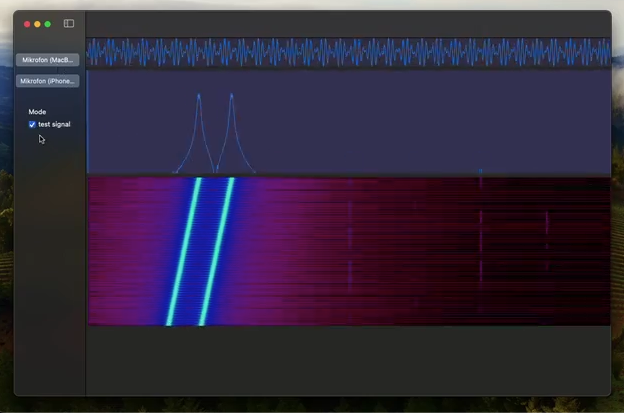

# app_SDFT (Sliding Discrete Fourier Transform)


## Overview
`app_SDFT` (Sliding Discrete Fourier Transform) is a cutting-edge application demonstrating the capability of computing SDFT on shaders within a computation pipeline. Designed primarily for macOS and iOS platforms, this app efficiently processes audio signals in real-time, leveraging the power of modern GPU computing.

### Demo Video
Obejrzyj krótkie demo aplikacji `app_SDFT` w akcji:
[](media/sdft_480p.mp4)

### Screenshot
Poniżej znajduje się screenshot z aplikacji, prezentujący wygenerowany spektrogram:


The application captures audio input from a Mac or iPhone microphone and visualizes it through both a time-domain waveform and a spectrogram. While the SDFT calculations are performed for every sample, the spectrogram updates are intentionally limited to several samples for better visual representation and performance, given the high rate of data processing.

## Key Features
- **Real-Time Audio Processing**: Captures live audio and processes it in real time.
- **SDFT Computation**: Utilizes shaders in a computation pipeline for efficient Sliding Discrete Fourier Transform calculations.
- **Waveform Visualization**: Displays the time-domain waveform of the audio signal.
- **Spectrogram Display**: Visualizes the frequency content of the audio signal with a spectrogram, updating at a practical rate for clarity.

## Requirements
- macOS or iOS device with microphone access.
- Suitable GPU for shader-based computations.

## Getting Started
1. Clone the repository: `git clone https://github.com/AdamLuczak/app_SDFT.git`.
2. Open the project in Xcode.
3. Build and run the application on your macOS or iOS device.

## Basic Usage

`AL_Metal_SDFT` is a Swift class designed for real-time audio signal processing and visualization using Sliding Discrete Fourier Transform (SDFT). The class utilizes Metal for GPU-accelerated computations, ensuring efficient processing of audio data.

### Initialization
To use `AL_Metal_SDFT`, first ensure that you have a suitable Metal-compatible device. Then, initialize the class as follows:
```swift
let sdftProcessor = AL_Metal_SDFT.shared
```

### Processing Audio Data
The main functionality of `AL_Metal_SDFT` is to process audio data and compute its SDFT. This is done through the `compute(dataContainer: [Float]) -> [Float]` method, which takes an array of audio sample data as input and returns the transformed data:
```swift
let audioData: [Float] = // Your audio data
let transformedData = sdftProcessor.compute(dataContainer: audioData)
```

### Accessing Results
After processing, you can access the results:
- `outputDFT`: The transformed data.
- `outputSig`: The original audio signal data.
- `outputBuf`: Buffer data.
- `outputSpec`: An array of `NSImage` objects representing the spectrogram of the audio data.

Example:
```swift
let dftData = sdftProcessor.outputDFT
let signalData = sdftProcessor.outputSig
let bufferData = sdftProcessor.outputBuf
let spectrogramImages = sdftProcessor.outputSpec
```

### Visualization
The computed spectrogram can be visualized using the images in `outputSpec`. Each `NSImage` in this array represents a segment of the spectrogram.

### Notes
- Ensure that the audio data provided to `compute(dataContainer:)` is in the correct format and size expected by the class.
- The SDFT computation and visualization are optimized for real-time performance, making `AL_Metal_SDFT` suitable for applications that require quick and efficient audio signal processing.

## Contributions and Feedback
Contributions to `app_SDFT` are welcome. Feel free to fork the repository, make changes, and submit a pull request. For any feedback or issues, please open an issue in the GitHub repository.

## License
This project is licensed under the MIT License with an additional attribution clause. The terms of the license are as follows:

- **Permission to Use**: Everyone is free to use, modify, and distribute copies of this software in both private and commercial settings.
- **Attribution Requirement**: If you use this software, modify it, or distribute it, you are required to credit the original author, Adam Łuczak. This can be done through a citation or a link back to the original repository.
- **No Warranty**: The software is provided "as is", without warranty of any kind, express or implied, including but not limited to the warranties of merchantability, fitness for a particular purpose, and noninfringement.
- **Liability**: In no event shall the author be liable for any claim, damages, or other liability, whether in an action of contract, tort, or otherwise, arising from, out of, or in connection with the software or the use or other dealings in the software.

For the full terms and conditions, please refer to the MIT License documentation.


## Contact
For any further inquiries or suggestions, please contact Adam Łuczak at adam.luczak@outlook.com.

---

Created by Adam Łuczak, 2024.
